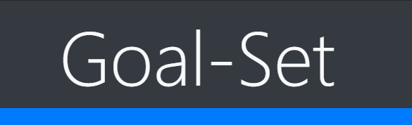
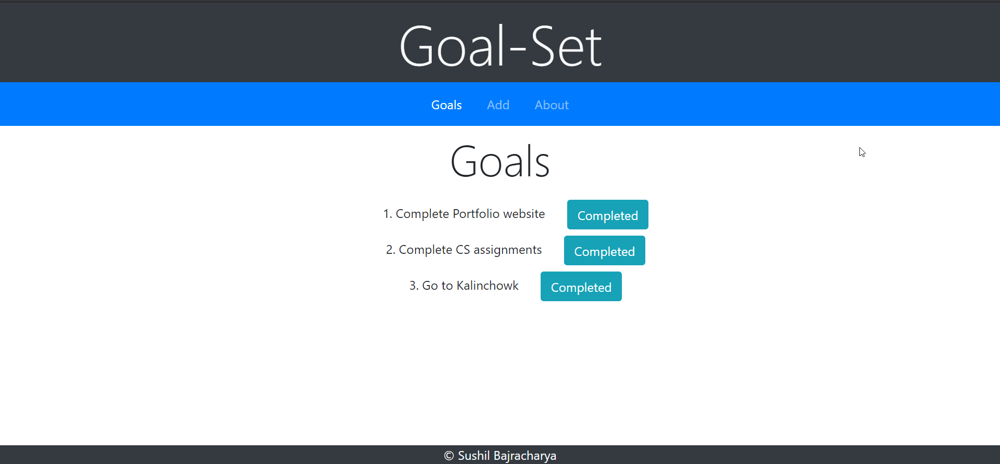
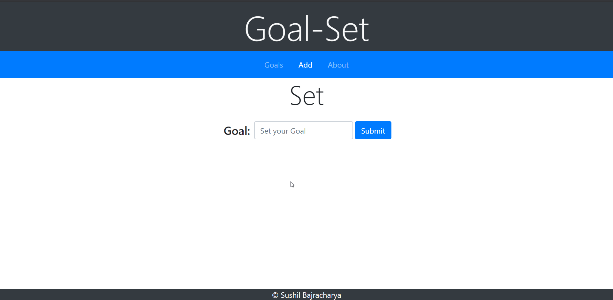

# Goal-Set

  

<h6 align="center"> A Productivity app where you set your goals and mark as completed as you complete the goal </h6>

Goal-Set is a Web app which is built with MongoDb, Express, EJs, Node Stack. It is simple web app where you
can set your goals and achieve them. Goal-set is an output of NodeJs Workshop that was held in MBM College.

## Goals
The main goal of this project was 
  * To learn about MongoDb, Express, EJs, Node Stack
  * To learn to deploy Web app in heroko 

## Contributors
* [SushilBajracharya01](https://github.com/SushilBajracharya01)

## Trainers
* [Ujjwal Acharya](https://github.com/ujjalacharya)
* [James Subedi](https://github.com/subedijames2017)
* And the Team

## Demo
👉 live demo: <a href="https://nodeworkshop-sushil.herokuapp.com/" target="_blank" >here</a>

## Features

- [x] Add Goals
- [x] Mark as Complete
- [X] nice UI
- [x] responsive design

## Built with
- [Mongodb](https://www.mongodb.com/)
- [ExpressJs](https://expressjs.com/)
- [EjS](https://ejs.co/)
- [NodeJs](https://nodejs.org/en/)

## License

MIT  © 
